# Spring Boot Microservice Messaging with RabbitMQ and AWS SQS - Part 1

## Reference Documentation

This project is a summary to the first part of Binit Datta's course at Udemy. It is based primarily on the references below:

* [Spring Boot 2 Microservice Messaging in RabbitMQ and AWS SQS](https://www.udemy.com/course/spring-boot-2-messaging-with-rabbitmq-activemq-and-aws-sqs/)

* [Part 1: RabbitMQ for beginners - What is RabbitMQ?](https://www.cloudamqp.com/blog/2015-05-18-part1-rabbitmq-for-beginners-what-is-rabbitmq.html)

* [Part 3: The RabbitMQ Management Interface](https://www.cloudamqp.com/blog/2015-05-27-part3-rabbitmq-for-beginners_the-management-interface.html)

* [Part 4: RabbitMQ Exchanges, routing keys and bindings](https://www.cloudamqp.com/blog/2015-09-03-part4-rabbitmq-for-beginners-exchanges-routing-keys-bindings.html)

### Features

These are the key features that we'll cover in this project:

        * Spring Boot 2.x

        * Service Discovery

        * Remote Configuration

        * RabbitMQ Point to Point Publisher/Consumer Applications

### Description

In this project, we use RabbitMQ to send messages from a Producer directly to a Single Consumer, using RabbitMQ Direct Exchanges and Queues. We have two applications, one Producer/Sender and one Consumer both complete separate to demonstrate the use case.

### RabbitMQ Point to Point Application Architecture

We have a single application, this is a very common use case you have seen multiple times in your life: the moment you register in a web site, you get an email after a few minutes. What happens? So that's what we'll demonstrate here.

In our Sprig Boot Account Registration application (Publisher/Producer), we will have an Account Controller, which is just a Spring public API. Then Account Controller will have an autowired object for Account Service. Account Service will have an Account Repository which is also autowired. Account Repository will persist data into a local MySQL database.

So, that is simple, like you are calling a REST API and the REST API is persisting data to MySQL; that is all simple.

But we need to send an email as well. How to send an email?

We cannot take time to make the Account Service responsible for actually sending the email. Sending email is slow and then our response to the customer will be slow as well. We cannot afford that.

So what we'll do is we'll send an asynchronous (that is, without blocking the customer) message or event using the Spring Event to the Account Event Listener.

That Account Event Listener is a listener internal to Spring and that listener is having an autowired object called Account Message Sender.

Account Message Sender sends the event to the Exchange referred to as account-exchange, which lives within RabbitMQ. We will define what Queues and Exchanges are slightly later.

Inside of the RabbitMQ Broker, there are two separate objects: account-exchange and account-queue. They are running separately in two JVMs. The account-exchange is bound to the account-queue and whenever the Direct Exchange named as account-exchange passes a new message to the account-queue, it automatically arrives into the Spring Boot Account Registration Consumer Application.

So it is pretty simple. We have a pretty lightweight Consumer Microservice as well. We have a single Java class annotated to tell Spring whenever there is a new message, it should invoke that method. Then the Consumer Microservice actually calls another listener, RabbitMQ Spring Boot AMQP Starter Event Listener which actually invokes the Spring Boot Email Sender, and we are using Spring Boot SMTP Starter Project which uses Google SMTP Email Sender to send an email.

This project is using Service Discovery and Config Service. The Config Service is getting properties from the GitHub Config Repository.

### Spring Cloud Microservice Service Discovery

Assuming we have a few microservices, all of these will be coming up, getting instantiated and running inside of a container.

So once they start up, right once they start up, they send their location information to the Service Registry, which, in this case, we will be using Spring Cloud Eureka.

Once the microservices start out, when they get instantiated, they actually push their location information, they push their IP and their port to the Eureka Service Registry.

One of the primary motivations to the microservice architecture is to provide loose coupling. How loose coupling happens here?

The clients do not have the hardcoded IP addresses of the Services they want to call at all. Instead, they query the Eureka Service Registry URL. So, whenever they want to call a microservice, they first call to the Eureka Microservice with a logical name.

So every Spring Cloud microservice uses a property called spring.application.name in its property file which is bootstrap.yml and that bootstrap.yml property is the logical name.

Every microservice has a logical name. The client has a logical name, the service they want to call has a logical name as well. So, that logical name is used for querying the Eureka service. And using the same logical name, the service that we want to call has registered to the Eureka.

Like we are saying, let's suppose we are running 5 instances of a microservice referred to as Product Content. So all 5 Product Content microservice instances have the same logical name. When each of the 5 comes up, however, they are running in a different IP address. They are sending the same name against the different IP address to the Eureka Service. Then, Eureka stores 5 different IP addresses and maybe ports against one logical name, let's say, product-content.

A client wants to call the Product Content microservice. It goes to Eureka with the logical name, let's say, product-content and Eureka gives 5 instances, that is, all the healthy microservice instances to the client and the client calls the microservice using one of the healthy instances.

### Service Discovery Benefits

        * Decouple our Service Clients with the actual services they call
            Clients no longer have to hard code IP addresses or domain names

        * Enhance Load Balancing and High Availability
            We no longer have to depend on one single hardware load balancer in front of each service going down and crashing our application.

        * Service Discovery High Availability
            Of course as Service Discovery is the heart of our Microservice based application, we run multiple instances and let them talk to each other.

        * Act as a central Hub for orchestration
            Service Discovery Cluster is the central hub on which the entire application is based on.

        
        * Health information
            Each microservice that registers with the Service Discovery has to send health information and load information to the Service Discovery cluster periodically.

        * Support other Patterns
            A number of other Microservice Patterns like Declarative Client, Hystrix Circuit Breaker and Client Side Load Balancing Ribbon depends on Service Discovery.

### Eureka Service Discovery Microservice Application

Surprisingly, we only have a single change to make, which is an annotation, in our program. This is the only coding change we need to make Eureka run.

            @SpringBootApplication
            @EnableEurekaServer
            public class RollingstoneEcommerceEurekaServiceDiscoveryApplication {

                public static void main(String[] args) {
                    SpringApplication.run(RollingstoneEcommerceEurekaServiceDiscoveryApplication.class, args);
                }

            }

We also need to make some property changes. For that, we'll add two files to the resource folder: application.yml and bootstrap.yml. One advantage over the property file is that it shows the properties in a hierarchy.

These files are treated really early when the Spring Cloud application starts up.

        bootstrap.yml file

            spring:
            application:
                name: rollingstone-eureka-service-discovery

        application.yml file

            server:
              port: 8761
            eureka:
              instance:
                hostname: localhost
            client:
              registerWithEureka: false
              fetchRegistry: false
              serviceUrl:
                defaultZone: http://${eureka.instance.hostname}:${server.port}/eureka/

Properties client.registerWithEureka and client.fetchRegistry are defined as false in order to avoid an error: there is no known Eureka server, because we have told the single running Server to communicate with another, and that other Server is not just there.

So, to take care of this, we can tell Eureka that those properties will be false.

Now we can go to the browser and enter the Eureka Server URL. This is the web site we will frequently go to check whether our Microservice instances are running well or not.

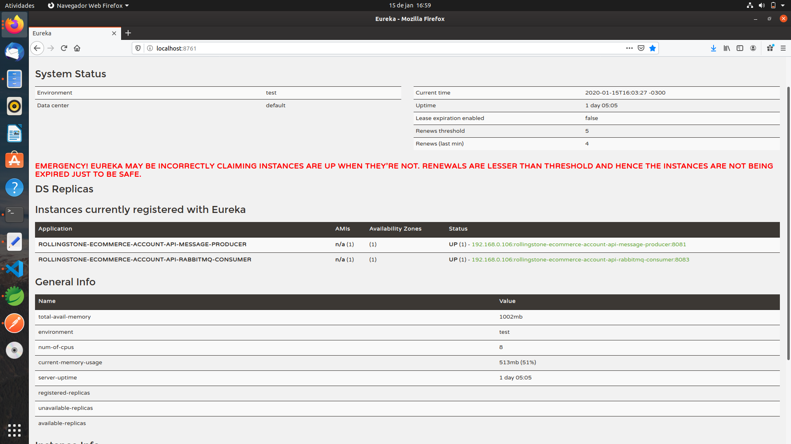

### Spring Cloud Remote Config Microservice Application

In the main class, we add the @EnableConfigServer.

            @SpringBootApplication
            @EnableConfigServer
            public class RollingstoneEcommerceRemoteConfigServiceApplication {

                public static void main(String[] args) {
                    SpringApplication.run(RollingstoneEcommerceRemoteConfigServiceApplication.class, args);
                }
            }

In the code, that is enough, we don't need anything else.

The olny other thing important in the Config Microservice is a couple of property files: application.yml and bootstrap.yml.

            application.yml

                server:
                port: 9000
                spring:
                cloud:
                    config:
                    server:
                        git: 
                        uri: https://github.com/rollingstoneecomm/rollingstone-ecommerce-remote-cqrs-config-repository
                        searchPaths: rollingstone-ecommerce-account-api-message-producer,rollingstone-ecommerce-account-api-rabbitmq-consumer,rollingstone-ecommerce-rabbitmq-fanout-sales-order-api-producer,rollingstone-ecommerce-rabbitmq-fanout-fulfillment-api-consumer,rollingstone-ecommerce-rabbitmq-fanout-finance-api-consumer
                        username: rollingstoneecomm
                        password: KeepLearning$$1
                management:
                server:
                    port: 9001
                endpoints:
                    web:
                    exposure:
                        include: "*"
                endpoint:
                    health:
                    show-details: "always"

            bootstrap.yml

                spring:
                application:
                    name:  rollingstone-ecommerce-remote-config-service 

In application.yml, firstly, we are telling Spring that the Config Microservice is going to run in 9000 port. In the next property, spring.cloud.config.server.git.uri, we need to tell Spring Spring Cloud Remote Config Microservice where is my property holding the Git Config Repository. So, we are telling Spring to automatically go to this Git Repository for properties.

And searchPath is the next important critical property. In the searchPath, we are having a comma separated list of all microservice applications that are developed.

The other two things are username and password.

The management properties are Actuator properties; if we need Actuator, then we will access it by port 9001. We are telling Spring to enable all Actuator endpoints and the health endpoint always, because, normally, Spring Boot, to the health endpoint, does not give us everything. So the moment we say always, it gives us a detailed health endpoint.

### AMQP / RabbitMQ Concepts

RabbitMQ is a message-queueing software also known as a message broker or queue manager. Simply said, it is software where queues are defined, to which applications connect in order to transfer a message or messages.

A message can include any kind of information. It could, for example, have information about a process or task that should start on another application (which could even be on another server), or it could be just a simple text message.

The queue-manager software stores the message until a receiving application connects and takes a message off the queue. The receiving application the process the message.

### RabbitMQ Example

A message broker acts as a middleman for various services (e.g. a web application, as in this example.). They can be used to reduce loads and delivery times of web application servers by delegating tasks that would normally take up a lot of time or resources to a third party that has no other job.

In this guide, we follow a scenario where a web application allows users to upload information to a website. The site will handle this information, generate a PDF, and email it back to the user. Handling the information, generating the PDF, and sending the email will, in this case, take several seconds. That is one of the reasons why a message queue will be used to perform the task.

When the user has entered user information into the web interface, the web application will create a "PDF processing" messsage that includes all of the important information the user needs into a message and place it onto a queue defined in RabbitMQ.

The basic architecture of a message queue is simple - there are client applications called producers that create messages and deliver them to the broker (the message queue). Other applications, called consumers, connect to the queue and subscribe to the messages to be processed. Software may act as a producer, or consumer, or both a consumer and a producer of messages. Messages placed onto the queue are stored until the consumer retrieves them.

### When and why should you use RabbitMQ?

Message queueing allows web servers to respond to requests quickly instead of being forced to perform resource-heavy procedures on the spot that may delay response time. Message queueing is also good when you want to distribute a message to multiple consumers or to balance loads between workers.

The consumer takes a message off the queue and starts processing the PDF. At the same time, the producer is queueing up new messages. The consumer can be on a totally different server than the producer or they can be located on the same server. The request can be created in one programming language and handled in another programming language. The point is, the two applications will only communicate through the messages they are sending to each other, which means the sender and receiver have low coupling.

            Example:

                1. The user sends a PDF creation request to the web application.

                2. The web application (the producer) sends a message to RabbitMQ that includes data from the request such as name and email.

                3. An exchange accepts the messages from the user. 

                4. The PDF processing worker (the consumer) receives the task message and starts processing the PDF.

### Exchanges

Messages are not published directly to a queue; instead, the producer sends messages to an exchange. An exchange is responsible for routing the messages to different queues with the help of bindings and routing keys. A binding is a link between a queue and an exchange.

### Message flow in RabbitMQ

        1. The producer publishes a message to an exchange. When creating an exchange, the type must be specified. 

        2. The exchange receives the message and is now responsible for routing the message. The exchange takes different message attributes into account, such as the routing key, depending on the exchange type.

        3. Bindings must be created from the exchange to queues. The exchange routes the message into the queues depending on message attributes.

        4. The messages stay in the queue until they are handled by a consumer.

        5. The consumer handles the message.

### Types of Exchanges

        * Direct: The message is routed to the queues whose binding key exactly matches the routing key of the message. For example, if the queue is bound to the exchange with the binding key pdfprocess, a message published with a routing key pdfprocess is routed to that queue.

        * Fanout: A fanout exchange routes messages to all of the queues bound to it.

        * Topic: The topic exchange does a wildcard match between the routing key and the routing pattern specified in the binding.

        * Headers: Headers exchanges use the message header attributes for routing.

### RabbitMQ and Server Concepts

Some important concepts need to be described before we dig deeper into RabbitMQ. The default virtual host, the default user, and the default permissions are used in the examples, so let's go over the elements and concepts:

        * Producer: Application that sends the messages.

        * Consumer: Application that receives the messages.

        * Queue: Buffer that stores messages.

        * Message: Information that is sent from the producer to a consumer through RabbitMQ. 

        * Connection: A TCP connection between your application and the RabbitMQ broker.

        * Channel: A virtual connection inside a connection. When publishing or consuming messages from a queue - it's all done over a channel.

        * Exchange: Receives messages from producers and publishes them to queues depending on rules defined by the exchange type. To receive messages, a queue needs to be bound to at least one exchange.

        * Binding: A binding is a link between a queue and an exchange.

        * Routing key: A key that the exchange looks at to decide how to route the message to queues. Think of the routing key like an address for the message.

        * AMQP: Advanced Messaging Queuing Protocol is the protocol used by RabbitMQ for messaging.

        * Users: It is possible to connect to RabbitMQ with a given username and password. Every user can be assigned permissions such as rights to read, write and configure privileges within the instance. Users can also be assigned permissions for specific virtual hosts.

        * Vhost, virtual host: Provides a way to segregate applications using the same RabbitMQ instance. Different users can have different permissions to different vhost and queues and exchanges can be created, so they only exist in one vhost.

        
In this RabbitMQ example, we had one producer (the website application) and one consumer (the PDF processing application). If the PDF processing application crashes, or if many PDF requests are coming at the same time, messages would continue to stack up in the queue until the consumer starts again. It would then process all the messages, one by one.

### Getting started with RabbitMQ

Immediately after a RabbitMQ instance has been created it is possible to send a message accross languages, platforms, and OS. This way of handling messages decouple your processes and creates a highly scalable system.

### The Management Interface - Management and Monitoring

RabbitMQ provides a web UI for the management and monitoring of your RabbitMQ server. The RabbitMQ management interface is enabled by default and we can access it by entering http://localhost:15672 in the web browser.

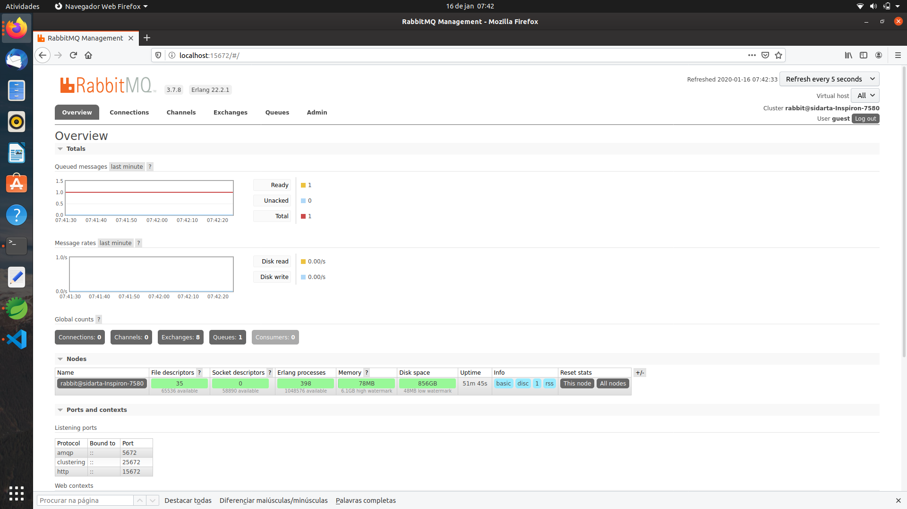

### Publish and Subscribe Messages

RabbitMQ uses a protocol called AMQP by default. To be able to communicate with RabbitMQ you need a library that understands the same protocol as RabbitMQ. Download the client library for the programming language that you intend to use for your applications. A client library is an application programming interface (API) for use in writing client applications. A client library has several methods; in this case, to communicate with RabbitMQ. The methods should be used when you connect to the RabbitMQ broker (using the given parameters, hostname, port number, etc.), for example, or when you declare a queue or an exchange. There is a choice of libraries for almost every programming language.

Steps to follow when setting up a connection and publishing a message/consuming a message:

        1. Set up/create a connection object. The username, password, connection URL, port, etc., will need to be specified. A TCP connection will be set up between the application and RabbitMQ when the start method is called.

        2. Create a channel in the TCP connection, then the connection interface can be used to open a channel through which to send and receive messages.

        3. Declare/create a queue. Declaring a queue will cause it to be created if it does not already exist. All queues need to be declared before they can be used.

        4. Set up exchanges and bind a queue to an exchange in subscriber/consumer. All exchanges must be declared before they can be used. An exchange accepts messages from a producer application and routes them to message queues. For messages to be routed to queues, queues must be bound to an exchange.

        5. In publisher: Publish a message to an exchange. In subscriber/consumer: Consume a message from a queue.

        6. Close the channel and the connection.

### Developing the Producer Microservice Application

In the Producer Microservice Application, AccountController is a Spring REST Controller class for the creation of an Account Registration.

            1. @PostMapping("/account")
            2. public ResponseEntity<?> createAccount(@RequestBody Account account) {
            3.     Account savedAccount = this.accountService.save(account);
            4.     AccountDTO accountDTO = this.accountService.getAccount(savedAccount.getId());
            5.     AccountEvent accountCreatedEvent = new AccountEvent(this, "AccountCreatedEvent", accountDTO);
            6.     eventPublisher.publishEvent(accountCreatedEvent); 
            7.     return ResponseEntity.ok().body("The new account has been saved with ID: " + savedAccount.getId());
            8. }

In the snippet code from above, an Account object is persisted in the local MySQL database. Then, we retrieve this newly created Account record from the database and store that into a DTO object. Afterwards, at line 5, a POJO Event object is instantiated passing in the event name (AccountCreatedEvent) and the DTO object to its constructor.

Then, at line 6, we publish this event to the Spring framework, passing in the event POJO object.

After that, the AccountEventListener class receives the event and processes it.

            1. @EventListener
            2. public void onApplicationEvent(AccountEvent accountEvent) {
            3.     LOG.info("Received Account Event: {} ", accountEvent.getEventType());
            4.	   LOG.info("Received Account from Account Event: {} ", accountEvent.getAccount().toString());
            5.	   LOG.info("Account created with ID: {} and First Name: {} and Last Name: {} ", accountEvent.getAccount().getAccountNumber(), accountEvent.getAccount().getFirstName(), accountEvent.getAccount().getLastName());
            6.	   this.accountMessageSender.sendMessage(rabbitTemplate, accountExchangeName, accountRoutingKey, accountEvent.getAccount());	
            7. }

In the snippet code from above, at line 6 we are calling the sendMessage method from AccountMessageSender to send data to the RabbitMQ broker. We should note that the Exchange name and the Routing Key that we defined in the application.yml property file are being passed in as well.

            application.yml

                spring:
                rabbitmq:
                    host: localhost
                    port: 5672
                    username: guest
                    password: guest

                account:
                exchange:
                    name: account-exchange
                queue:
                    name: account-queue
                routing:
                    key: account-routing-key

Finally, in the AccountMessageSender class, the message is sent, as we can see in the snippet code below at line 3.

            1. public void sendMessage(RabbitTemplate rabbitTemplate, String accountExchange, String accountRoutingKey, Object accountData) {
            2.    LOG.info("Sending message to the Account Queue using accountRoutingKey {}, Message = {} ", accountRoutingKey, accountData);
            3.    rabbitTemplate.convertAndSend(accountExchange, accountRoutingKey, accountData);
            4.    LOG.info("The Account Message was sent");
            5. }

### Developing the Consumer Microservice Application

In the Consumer application, the AccountRabbitMQMessageConsumerListener class is responsible for consuming the message through a method that has to be annotated with @RabbitListener.

In this way, the receiveMessageForApi method receives a message from a queue and processes that, sending an email to the customer who made an Account Registration in the web site.

            @RabbitListener(queues = "${account.queue.name}")
                public void receiveMessageForApi(final AccountDTO accountDTO) {
                    LOG.info("Received AccountDTO message: {} ", accountDTO.toString());
                    try {
                        this.sendEmail(accountDTO);
                    } catch (HttpClientErrorException e) {
                        ...
                    }
                    LOG.info("Email Sent");
                }

## Testing the RabbitMQ Producer and Consumer Microservice Applications

### Steps to Test the Eureka Server Microservice Application

These are the steps to run the Service Discovery Eureka Server:

            1. Open a terminal window

            2. cd rollingstone-ecommerce-eureka-service-discovery

            3. mvn clean install

            4. java -jar target/rollingstone-ecommerce-eureka-service-discovery-1.0.jar

            5. Navigate: http://localhost:8761/

We should see the Eureka Monitoring Console.

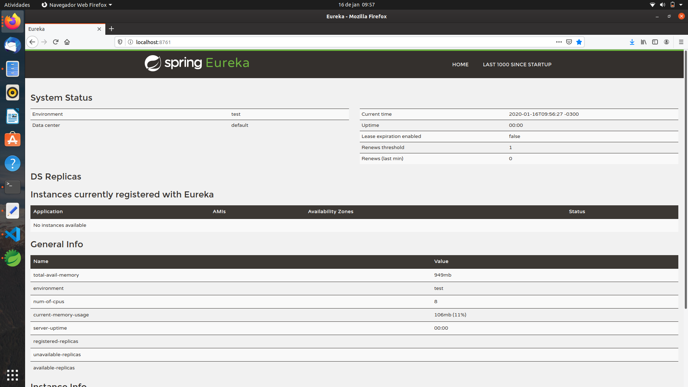

### Steps to Test the Config Server Microservice Application

These are the steps to run the Spring Cloud Config Server:

            1. Open another new terminal window

            2. cd rollingstone-ecommerce-remote-config-service

            3. gradle clean build

            4. java -jar build/libs/rollingstone-ecommerce-remote-config-service-1.0.jar

            5. Navigate to test: http://localhost:9000/rollingstone-ecommerce-account-api-message-producer/mysql

Then we should see the Producer Application configuration properties in JSON format in the browser.

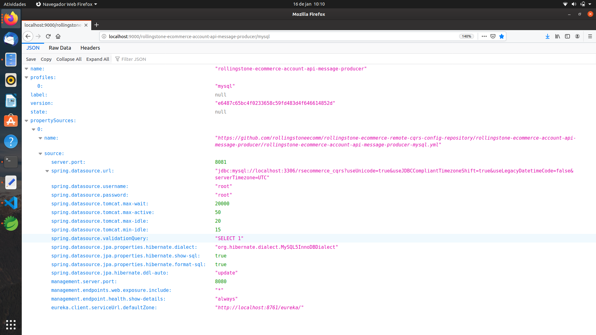

            6. Navigate to test: http://localhost:9000/rollingstone-ecommerce-account-api-rabbitmq-consumer/mysql

Then we should see the Consumer Application configuration properties in JSON format in the browser.

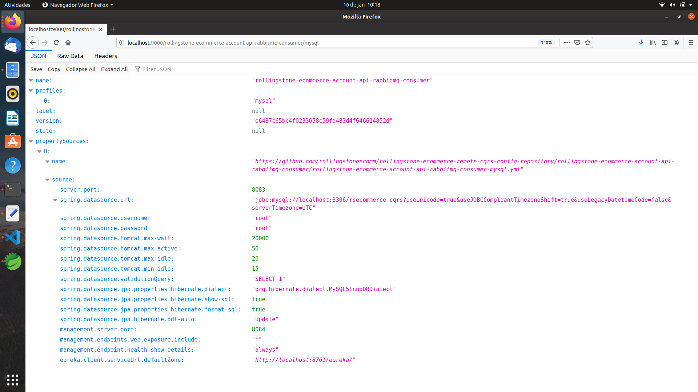

### Steps to Test the Producer Microservice Application

These are the steps to run the Producer Microservice:

            1. Open another new terminal window.

            2. cd rollingstone-ecommerce-account-api-rabbitmq-producer

            3. gradle clean build -x test

            4. java -jar -Dspring.profiles.active=mysql build/libs/rollingstone-ecommerce-account-api-rabbitmq-producer-1.0.jar

Let's have a look at some logging lines from the Producer Console.

    2020-01-16 10:30:10.341  INFO 23715 --- [           main] c.c.c.ConfigServicePropertySourceLocator : Fetching config from server at : http://localhost:9000
    2020-01-16 10:30:11.177  INFO 23715 --- [           main] c.c.c.ConfigServicePropertySourceLocator : Located environment: name=rollingstone-ecommerce-account-api-message-producer, profiles=[mysql], label=null, version=e6487c65bc4f0233658c59fd483d4f646614852d, state=null
    2020-01-16 10:30:11.178  INFO 23715 --- [           main] b.c.PropertySourceBootstrapConfiguration : Located property source: CompositePropertySource {name='configService', propertySources=[MapPropertySource {name='configClient'}, MapPropertySource {name='https://github.com/rollingstoneecomm/rollingstone-ecommerce-remote-cqrs-config-repository/rollingstone-ecommerce-account-api-message-producer/rollingstone-ecommerce-account-api-message-producer-mysql.yml'}]}
    2020-01-16 10:30:11.187  INFO 23715 --- [           main] rceAccountApiRabbitmqProducerApplication : The following profiles are active: mysql

We can see in the logging lines from above that the Producer Application is fetching its configuration data from the Config Server; the configuration is retrieved according to the Spring application profile, which is defined as mysql.

In the logging line below, we can see that the Producer Microservice is now registered within the Eureka Service Discovery.

    2020-01-16 10:30:20.563  INFO 23715 --- [nfoReplicator-0] com.netflix.discovery.DiscoveryClient    : DiscoveryClient_ROLLINGSTONE-ECOMMERCE-ACCOUNT-API-MESSAGE-PRODUCER/192.168.0.106:rollingstone-ecommerce-account-api-message-producer:8081 - registration status: 204

We're able to check out this registration in the Eureka Monitoring Web Console as well.

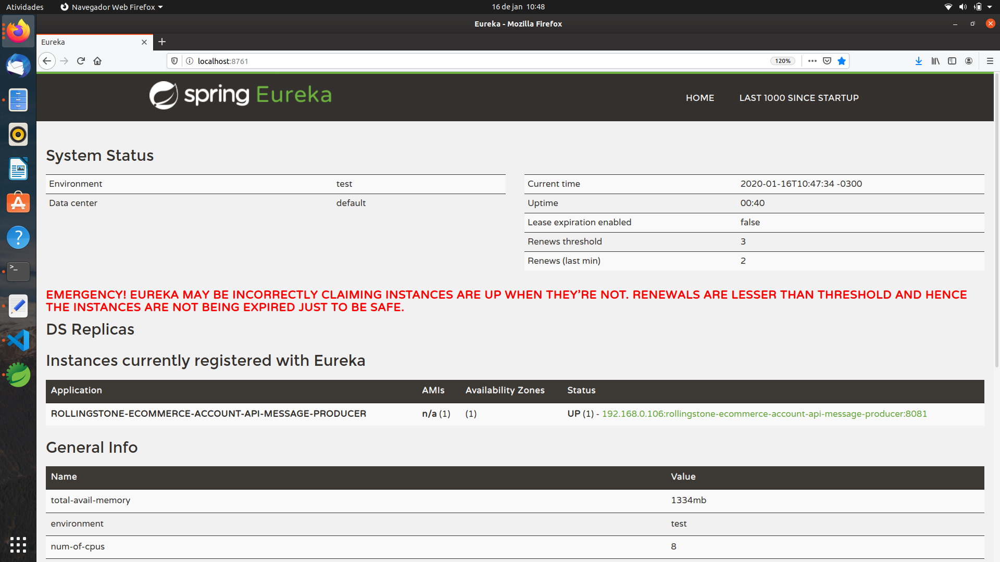

### Steps to Test the Consumer Microservice Application

These are the steps to run the Consumer Microservice:

            1. Open another new terminal window.

            2. cd rollingstone-ecommerce-account-api-rabbitmq-consumer

            3. gradle clean build -x test

            4. Create a new queue in RabbitMQ Admin Console : account-queue

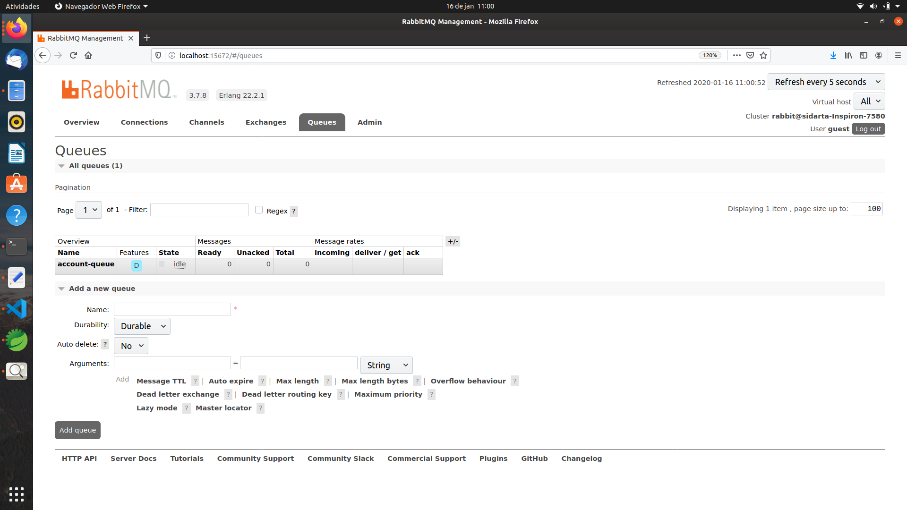
            

            4. java -jar -Dspring.profiles.active=mysql build/libs/rollingstone-ecommerce-account-api-rabbitmq-producer-1.0.jar

And we're able check out the Consumer Microservice registration into the Eureka Monitoring Web Console as well.

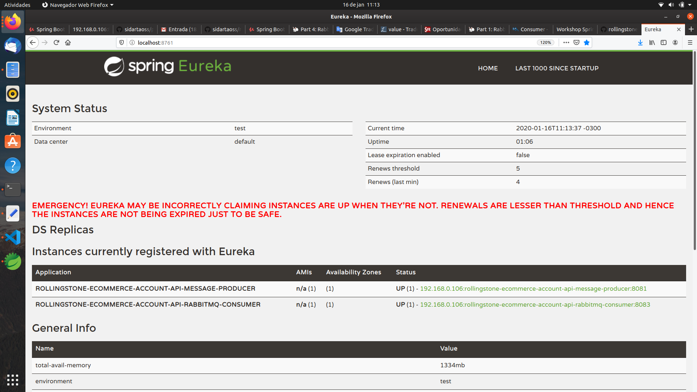

### Steps to Test Both the Producer and Consumer Microservice Applications

            1. Open the Postman REST API Testing tool.

            2. Select POST as HTTP Method.

            3. Select the Body Tab.

            4. Enter
                {
                    "accountNumber": "989460",
                    "accountName": "Steve Smith's Test Creating a New Account",
                    "user": {
                        "id": 1
                    }
                }

            5. Click Send.

            6. Check if we are getting the HTTP 200 Success

As we can see below, a new Account Registration is created.

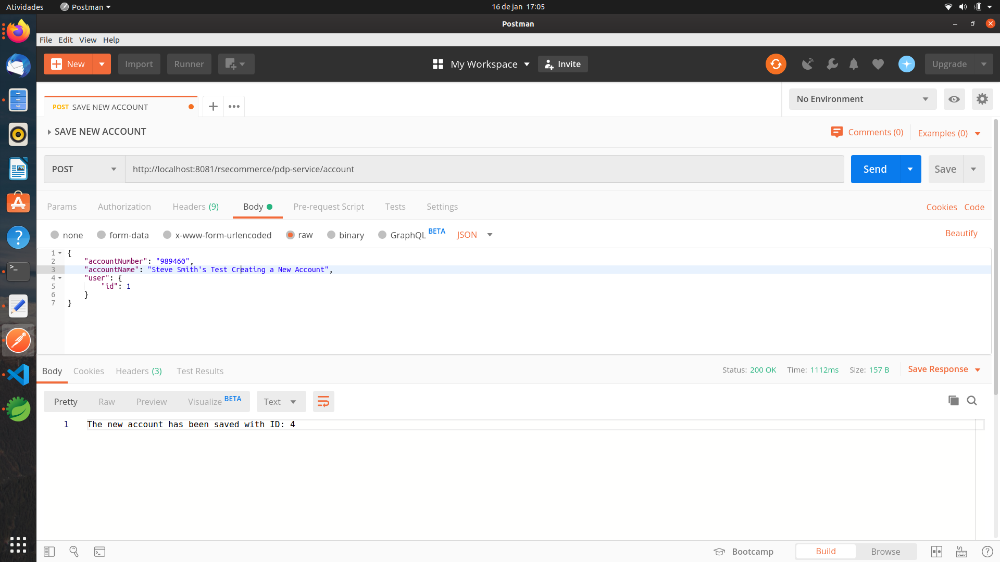

            7. Check your RabbitMQ Producer Application Console

Let's have a look at the logging lines from the Producer Console to check out the creation of a message to be sent to the account-queue.

    These are the logging lines mapping the Producer Microservice sending data from the saved Account to the RabbitMQ Broker.
    2020-01-16 17:05:08.225  INFO 26284 --- [nio-8081-exec-1] c.r.aspects.RestControllerAspect         : All method calls invoke this general aspect method
    2020-01-16 17:05:08.674  INFO 26284 --- [nio-8081-exec-1] c.r.spring.service.AccountServiceImpl    : Inside getAccount method
    2020-01-16 17:05:08.707  INFO 26284 --- [nio-8081-exec-1] c.r.spring.service.AccountServiceImpl    : accountDTO is not null
    2020-01-16 17:05:08.707  INFO 26284 --- [nio-8081-exec-1] c.r.listeners.AccountEventListener       : Received Account Event: AccountCreatedEvent 
    2020-01-16 17:05:08.707  INFO 26284 --- [nio-8081-exec-1] c.r.listeners.AccountEventListener       : Received Account from Account Event: AccountDTO [id=4, accountNumber=989460, accountName=Steve Smith's Test Creating a New Account, userName=stevesmith, firstName=Steve, lastName=Smith, sex=MALE, memberType=g, registrationDate=2011-12-31] 
    2020-01-16 17:05:08.707  INFO 26284 --- [nio-8081-exec-1] c.r.listeners.AccountEventListener       : Account created with ID: 989460 and First Name: Steve and Last Name: Smith 
    2020-01-16 17:05:08.707  INFO 26284 --- [nio-8081-exec-1] c.r.listeners.AccountMessageSender       : Sending message to the Account Queue using accountRoutingKey account-routing-key, Message = AccountDTO [id=4, accountNumber=989460, accountName=Steve Smith's Test Creating a New Account, userName=stevesmith, firstName=Steve, lastName=Smith, sex=MALE, memberType=g, registrationDate=2011-12-31] 
    2020-01-16 17:05:08.715  INFO 26284 --- [nio-8081-exec-1] o.s.a.r.c.CachingConnectionFactory       : Attempting to connect to: [localhost:5672]
    2020-01-16 17:05:08.822  INFO 26284 --- [nio-8081-exec-1] o.s.a.r.c.CachingConnectionFactory       : Created new connection: rabbitConnectionFactory#777c9dc9:0/SimpleConnection@496c1df2 [delegate=amqp://guest@127.0.0.1:5672/, localPort= 57168]
    2020-01-16 17:05:09.122  INFO 26284 --- [nio-8081-exec-1] c.r.listeners.AccountMessageSender       : The Account Message was sent
    2020-01-16 17:05:09.123  INFO 26284 --- [nio-8081-exec-1] c.r.aspects.RestControllerAspect         : This Aspect method is called only on Account Save
-

            8. Check your RabbitMQ Consumer Application Console.

These are the logging lines which map the reception of a message from the account-queue and the dispatch of an email to the customer.

    2020-01-16 17:18:59.417  INFO 28407 --- [cTaskExecutor-1] c.AccountRabbitMQMessageConsumerListener : Received AccountDTO message: AccountDTO [id=4, accountNumber=989460, accountName=Steve Smith's Test Creating a New Account, userName=stevesmith, firstName=Steve, lastName=Smith, sex=MALE, memberType=g, registrationDate=Sat Dec 31 22:00:00 BRST 2011] 
    2020-01-16 17:18:59.428  INFO 28407 --- [           main] o.s.b.w.embedded.tomcat.TomcatWebServer  : Tomcat started on port(s): 8083 (http) with context path ''
    2020-01-16 17:18:59.430  INFO 28407 --- [           main] rceAccountApiRabbitmqConsumerApplication : Started RollingstoneEcommerceAccountApiRabbitmqConsumerApplication in 6.322 seconds (JVM running for 6.688)
    2020-01-16 17:19:04.874  INFO 28407 --- [cTaskExecutor-1] c.AccountRabbitMQMessageConsumerListener : Email Sent
-

            9. Check the Database for new Data.

We can check out the creation of a new Account Registration record in our local MySQL database.

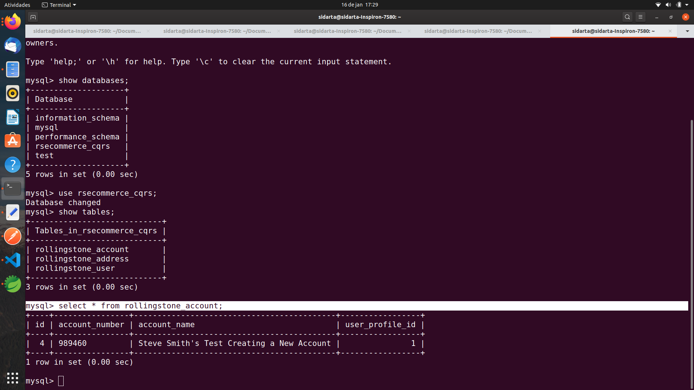

            10. Check your Email for the registration email.

And we can check out that an email was sent with registration information from the newly created Account record as well.

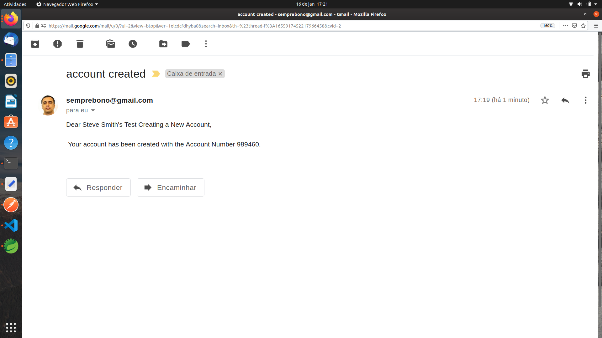

            11. Check the RabbitMQ Admin Console for queued messages

Let's have a look in the RabbitMQ Console to check out whether there are still queued messages to be processed or not.

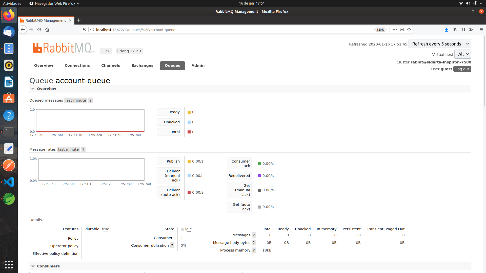

As we can see, there are no queued messages for being processed by the Consumer Microservice; meaning that our Point to Point Producer/Consumer use case is finally and successfully completed.